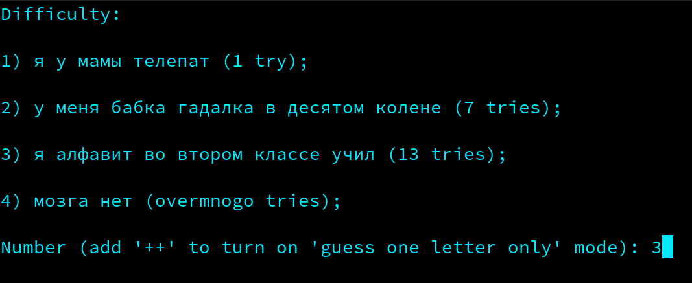
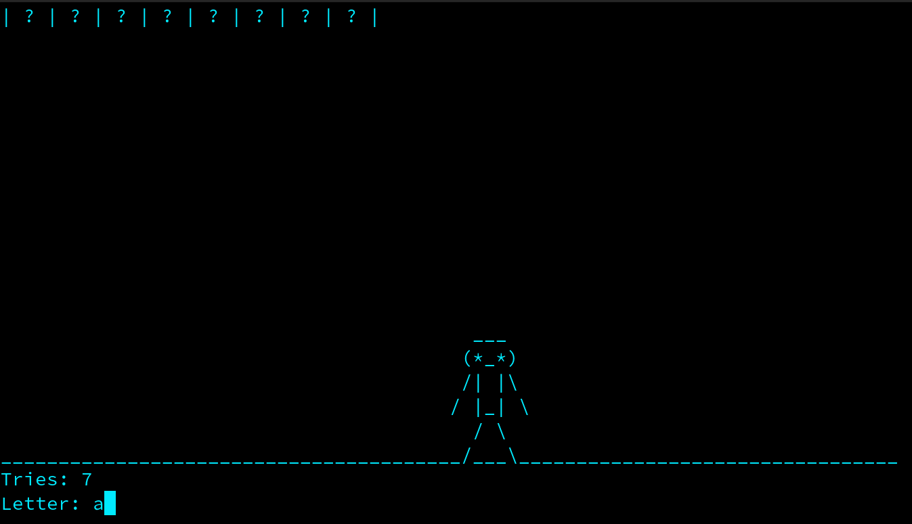
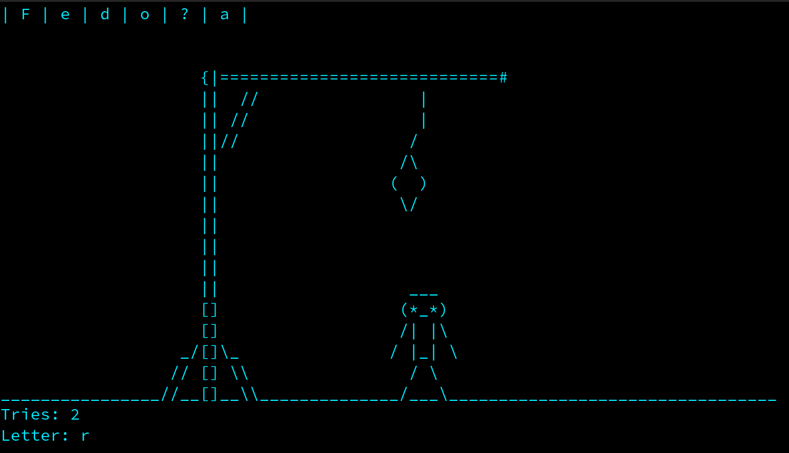
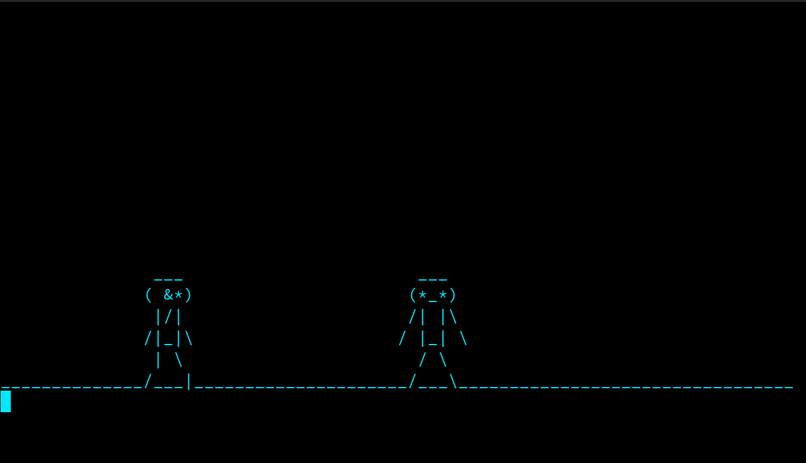
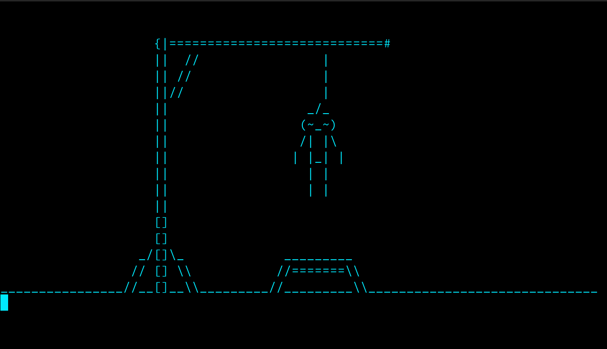
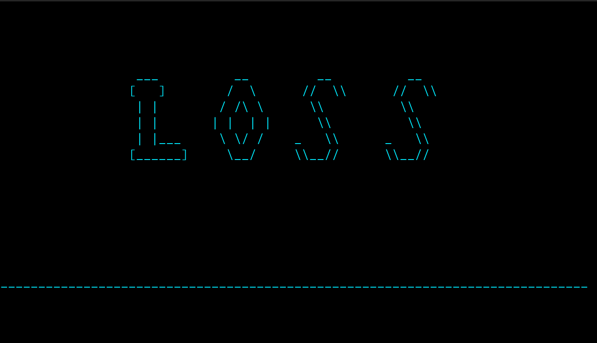
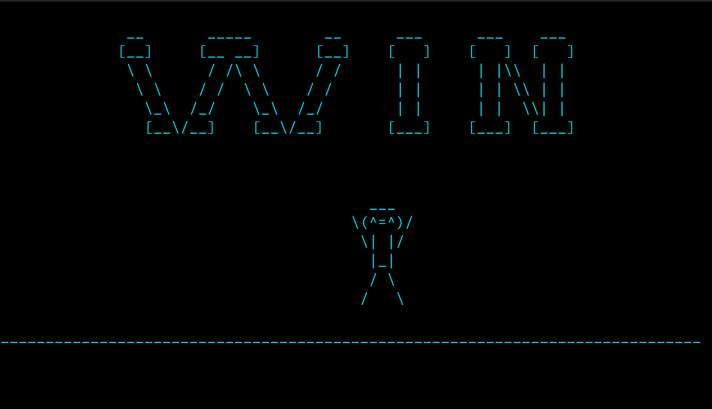

# Gallows (Hangman) game application

## Description

This project contains multiple implementation handling Hangman game logic. There's an offline **[console app](./index.js)** version which can be simply run using conosle command. An [online](./server/) app version is avalivable as well: to use it, firstly run a **[server](./server/index.js)** script and then launch a **client** one. They used one of defined connection strategies (**[dataraw](./server/strategies/dataraw/), [streamable](./server/strategies/streamable/)**) and connection types (**HTTP, WS, UDP and TCP**) defined in a config (**[here's](./server/env.example.json)** example) - **env.json**. Besides the mentioned options, the config also contains connection address (host & port). The client can be used as both [console](./server/client.js) and [browser](./server/public/) apps.

## Commands

To run offline console app:
```bash
npm run console
```

To run server app:
```bash
npm run server
```

To run online client app:
```bash
npm run client
```

## Gameplay

Choose difficulty:



Main gameplay (wordguessing):





Loss cases:







Win case (guess a word):


